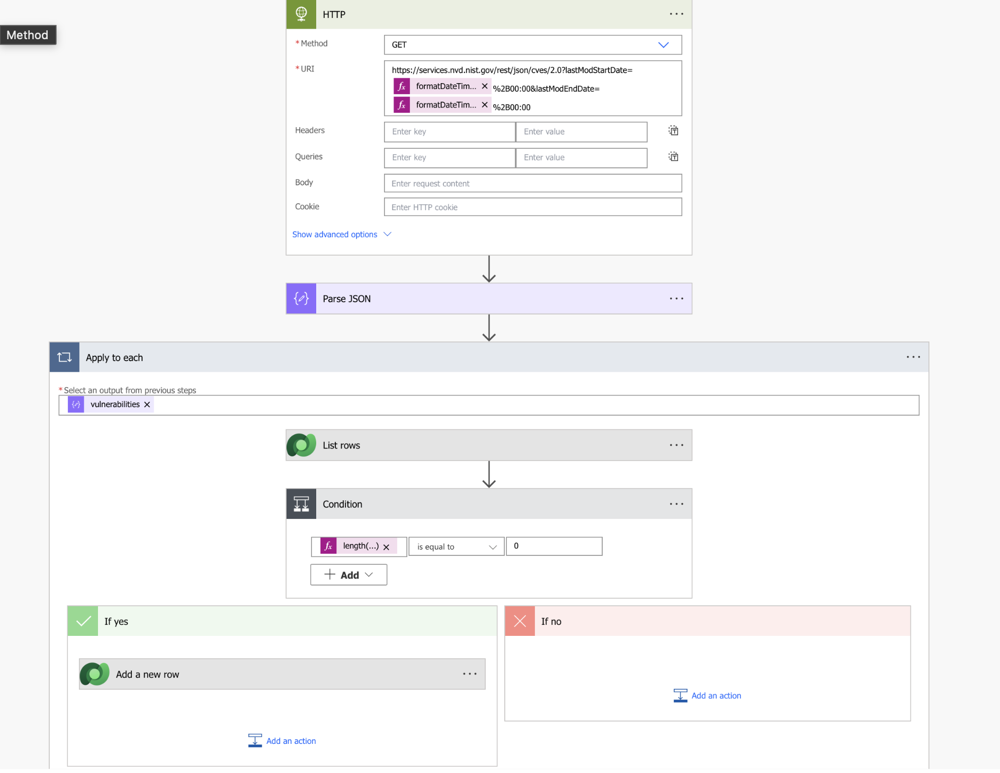
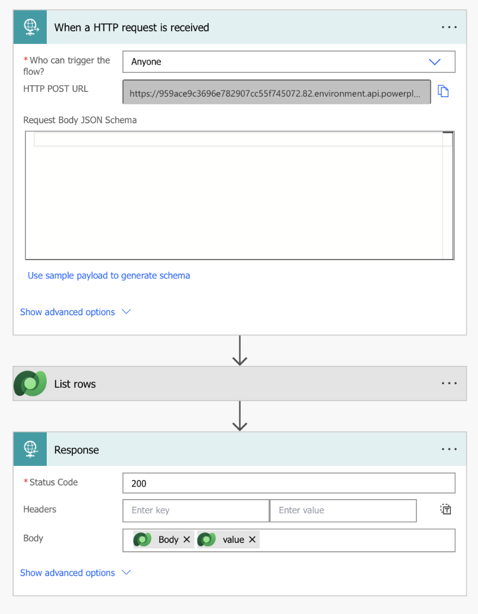

### Link
**https://automated-cve-threat-intelligence.onrender.com**

### Motivation
จริงๆตอนแรกผมกะจะทำเป็น Microsoft Ecosystem ทั้งหมดเลย Power page + automate + dataverse แต่ว่าผมลองใช้ Power Page แล้วมันไม่ถนัด เลยตัดสินใจไปทำ Custom ดีกว่าแต่ยังใช้ Dataverse + Automated อยู่เพราะว่ามันเหมือนเป็น Database กับ Business logic ไปในตัวแล้ว ทำให้ไม่ต้องลงแรงงมโค๊ดเยอะมาก แล้วเราจะมาปรับแต่งพวกCSS หรือ Proxy ได้ง่ายกว่าถึงสุดท้ายมัันจะมีปัญหาเรื่อง Tenant แต่ก็มุดเอา Dataverse มาแบบโต้งๆได้ เพราะคิดว่ามันไม่น่ามีปัญหาอะไรมันเป็นข้อมูลที่ไม่ได้ Sensitive   
### Architecture & Tech Stack
* Data Source: NVD API  
* Database: Microsoft Dataverse  
* Pipeline & API Gateway: Power Automate (ใช้เป็น HTTP Trigger)  
* Backend Proxy: Golang (ใช้จัดการ CORS และดึงข้อมูล * เพราะว่าพยายามดึงจากfrontendตรงๆแล้วแต่ว่า flow ของHTTP มันกันไม่ให้ส่งheaderอะไรให้เลย เลยต้องใช้ Go Proxy)  
* Frontend: HTML, CSS, JS  
  
### Problem Encounter and mitigation:
* IT ของ CMU เขาบล็อคไม่ให้นักศึกษาสร้างApp register ใน Entra ID ระดับ Tenant ทำให้การเรียกใช้Dataverseแบบปลอดภัยมีปัญหา ผมเลยแก้ด้วยการใช้ Power Automate มุดสร้าง API Gateway ดึงข้อมูลจาก Dataverse ออกมาแทน
* Data Duplicate แก้ด้วย Flow Logic ดักข้อมูลซ้ำก่อนบันทึกลง Database
* Mapping JSON Instructor จริงๆใน Power app เขาก็มีAuto generateตามที่เราก็อปไปว่างอยู่แล้วส่วนนี้ก็เลยไม่เป็นปัญหามากครับ

### Power Automated flows

1. **CVE_Auto_DaySync**  ตัวนี้เป็น Flow เอาไว้อัพเดทCVEใหม่ๆวันต่อวันลงใน Dataverse mapping จาก NVD Api json parser ก่อนแล้วถึงไปเช็ต Duplicate ของดาต้า ก่อนจะแอดลง Dataverse

2. **Data Access flow** ตัวนี้จะเป็นตัว Post ข้อมูลจาก Dataverse ออกให้ตัว Go proxy ส่งให้ Frontend render ออกมา

ซึ่งจะส่งดาต้าทั้งหมดในดาต้าเบสออกไปเป็นก้อนทีเดียวซึ่งทำให้ในอนาคตอาจจะมีปัญหาเรื่องความหน่วงเนื่องจากข้อมูลมันใหญ่

### How to run
```
    go run main.go  ใช้อันนี้ก็พอโปรเจคไม่ใหญ่มาก
    or
    go build -o server main.go (For build server in binary)
```
เซิฟเวอร์จะเปิดตาม URL ที่เด้งขึ้นมา
