### Link
**https://automated-cve-threat-intelligence.onrender.com**

### Motivation
จริงๆตอนแรกผมกะจะทำเป็น Microsoft Ecosystem ทั้งหมดเลย Power page + automate + dataverse แต่ว่าผมลองใช้ Power Page แล้วมันไม่ถนัด เลยตัดสินใจไปทำ Custom ดีกว่าแต่ยังใช้ Dataverse + Automated อยู่เพราะว่ามันเหมือนเป็น Database กับ Business logic ไปในตัวแล้ว ทำให้ไม่ต้องลงแรงงมโค๊ดเยอะมาก แล้วเราจะมาปรับแต่งพวกCSS หรือ Proxy ได้ง่ายกว่าถึงสุดท้ายมัันจะมีปัญหาเรื่อง Tenant แต่ก็มุดเอา Dataverse มาแบบโต้งๆได้ เพราะคิดว่ามันไม่น่ามีปัญหาอะไรมันเป็นข้อมูลที่ไม่ได้ Sensitive   
### Architecture & Tech Stack
* Data Source: NVD API
* Database: Microsoft Dataverse
* Pipeline & API Gateway: Power Automate (ใช้เป็น HTTP Trigger)
* Backend Proxy: Golang (ใช้จัดการ CORS แล้วก็เป็นตัวกลางยิงไปหา Power Automate อีกที เพราะถ้าพยายามดึงจาก frontend ตรงๆ flow ของ HTTP มันมีข้อจำกัดเรื่อง header/CORS เลยใช้ Go Proxy มาคั่นไว้)
* Frontend: HTML, CSS, JS

### Problem Encounter and mitigation:
* IT ของ CMU เขาบล็อคไม่ให้นักศึกษาสร้าง App register ใน Entra ID ระดับ Tenant ทำให้การเรียกใช้ Dataverse แบบปลอดภัยมีปัญหา ผมเลยแก้ด้วยการใช้ Power Automate มุดสร้าง API Gateway ดึงข้อมูลจาก Dataverse ออกมาแทน
* Data Duplicate แก้ด้วย Flow Logic ดักข้อมูลซ้ำก่อนบันทึกลง Database
* Mapping JSON Instructor จริงๆใน Power app เขาก็มี Auto generate ตามที่เราก็อปไปว่างอยู่แล้วส่วนนี้ก็เลยไม่เป็นปัญหามากครับ
* ปัญหาใหม่ที่เจอคือพอข้อมูล CVE ใน Dataverse เริ่มเยอะ ถ้าให้ client ดึง Data ออกมาทีเดียวทั้งก้อนมันมีโอกาส timeout / 502 NoResponse ได้ เลยต้องเพิ่ม Pagination ให้ flow กับ frontend ดึงทีละหน้าแทน

### Power Automated flows

1. **CVE_Auto_DaySync**  ตัวนี้เป็น Flow เอาไว้อัพเดท CVE ใหม่ๆวันต่อวันลงใน Dataverse mapping จาก NVD Api json parser ก่อนแล้วถึงไปเช็ต Duplicate ของดาต้า ก่อนจะแอดลง Dataverse

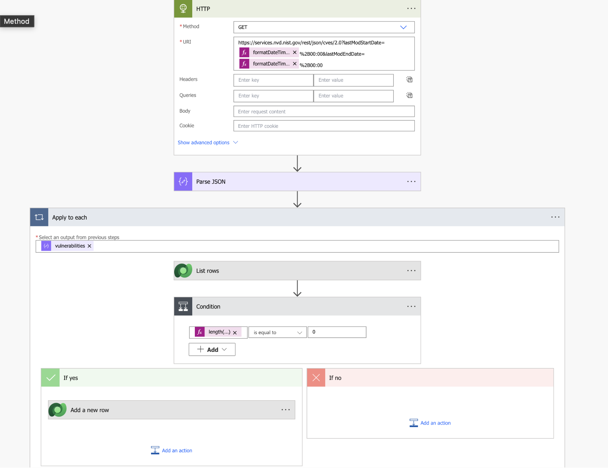

2. **Data Access flow** ตัวนี้จะเป็นตัว Post ข้อมูลจาก Dataverse ออกให้ตัว Go proxy ส่งให้ Frontend render ออกมา

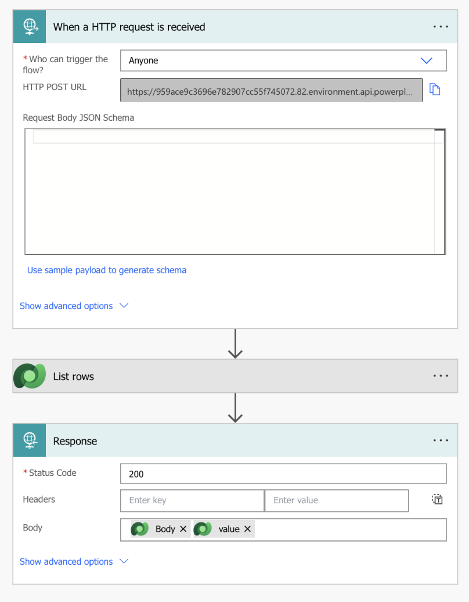

ตอนแรก flow นี้ส่งดาต้าทั้งหมดใน Database ออกมาเป็นก้อนเดียว ซึ่งตอนข้อมูลยังน้อยก็ไม่เป็นไร แต่ถ้าข้อมูลเริ่มเยอะขึ้นมันจะเริ่มหน่วง แล้วก็มีโอกาส timeout เพราะ client ต้องรอ response ก้อนใหญ่เกินไป

### Debug ที่เจอระหว่างแก้ Pagination

ตอนแรกผมเพิ่ม schema ของ HTTP Trigger ให้รับค่าพวกนี้:

* `filterString` เอาไว้ส่ง OData filter เข้า List rows
* `limit` เอาไว้กำหนดจำนวน row ต่อรอบ
* `nextToken` ตอนแรกกะใช้กับ Skip token
* `page` เพิ่มทีหลังตอนเปลี่ยนไปใช้ FetchXML pagination
* `fetchXml` เพิ่มทีหลังสุด เพราะถ้าเอา dynamic content ไปแทรกกลาง XML ใน Power Automate มันชอบพัง เลยให้ Go ประกอบ FetchXML ทั้งก้อนแล้วส่งเข้า flow ไปเลย

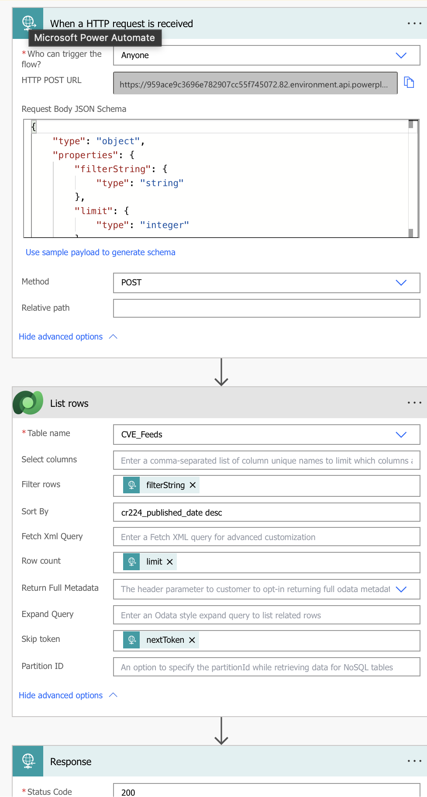

#### 1. filterString ว่างแล้ว List rows พัง

ตอนแรก Go proxy ยิง request เข้า flow แล้ว `filterString` เป็นค่าว่าง ทำให้ `List rows` ได้ช่อง Filter rows ว่าง แล้วเจอ BadRequest

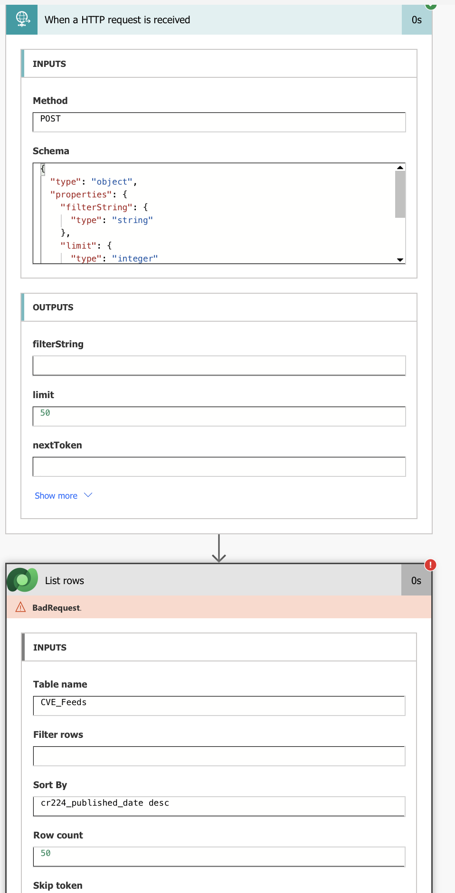

เลยแก้ฝั่ง Go ให้ถ้า frontend ไม่ได้ส่ง filter มา ก็ใส่ default filter ให้ก่อน:

```text
cr224_cve_id ne null
```

หลังใส่ filter แล้ว flow run ผ่าน

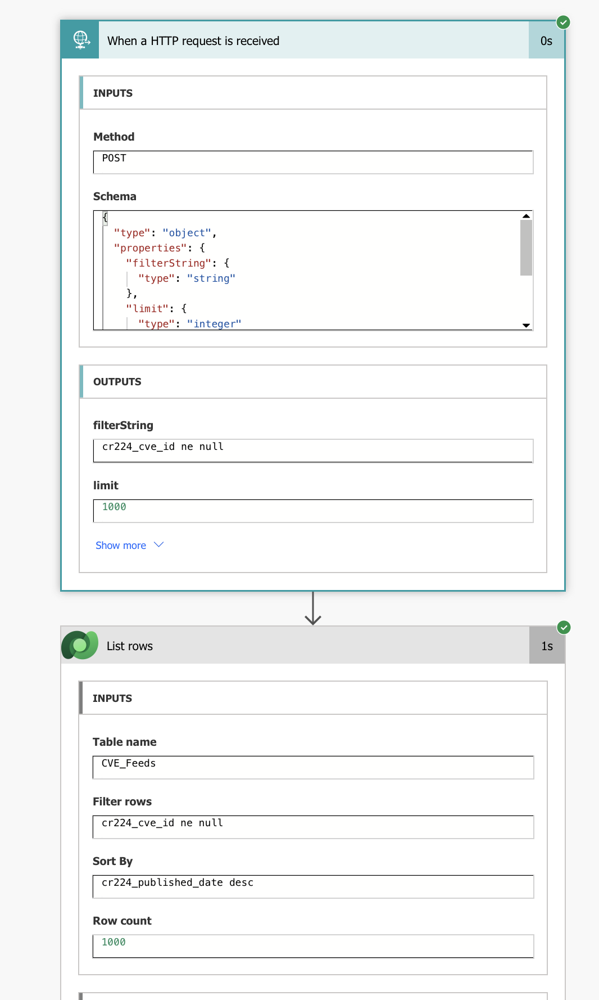

ตัวอย่าง run ที่ HTTP trigger -> List rows -> Response ผ่านครบ

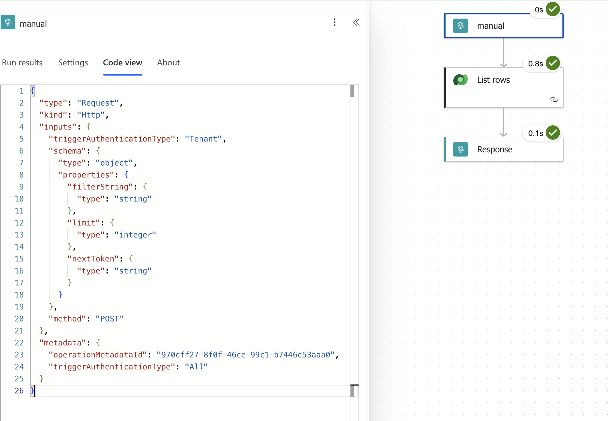

#### 2. ลองใช้ nextToken / Skip token แล้วไม่เวิร์ค

ตอนแรกพยายามแก้ด้วยวิธีใช้ Skip token ของ Dataverse โดยให้ List rows ส่ง `@odata.nextLink` กลับมาเป็น `nextToken` แล้ว frontend ค่อยส่ง token กลับมาในรอบถัดไป

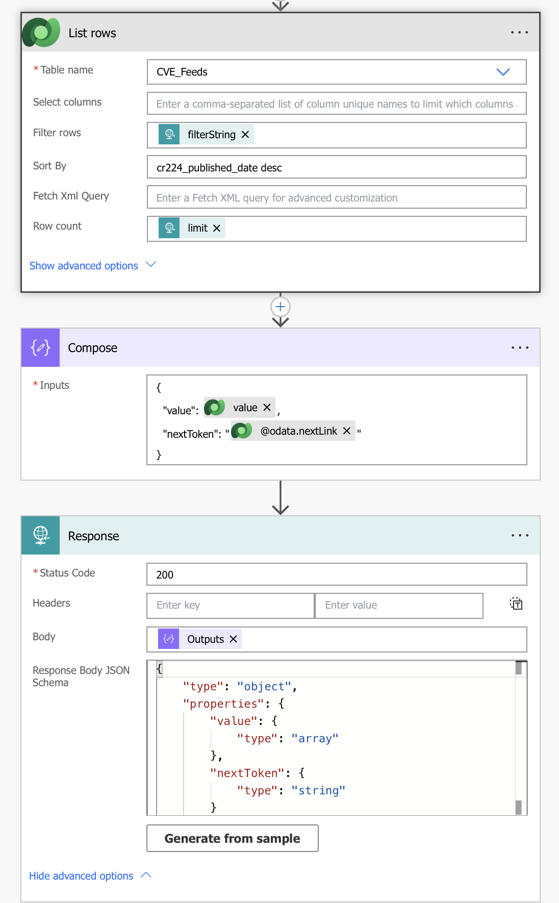

แต่ปัญหาคือ `List rows` ไม่ได้ส่ง next link ออกมาจริง ค่า `nextToken` ที่ได้กลับมาเป็น string ว่าง ถึงแม้จะลองเปิด/ปิด Pagination setting หรือเอา Skip token ออกแล้วก็ตาม สรุปคือทางนี้ไม่ค่อยเหมาะกับ flow นี้

#### 3. เปลี่ยนมาใช้ FetchXML + page แทน

สุดท้ายเลยเปลี่ยนแนวคิดจาก `nextToken` เป็นใช้เลขหน้าแทน คือ frontend ส่ง `page=1`, `page=2`, `page=3` ไปเรื่อยๆ แล้วใน Power Automate ให้ `List rows` ใช้ FetchXML Query เป็นตัวจัดหน้าเอง

FetchXML ที่ใช้ใน `List rows` ตอนแรกเขียนไว้ใน flow แบบนี้:

```xml
<fetch count="@{triggerBody()?['limit']}" page="@{triggerBody()?['page']}">
  <entity name="cr224_cve_feed">
    <attribute name="cr224_cve_id" />
    <attribute name="cr224_cwe_id" />
    <attribute name="cr224_cvss_score" />
    <attribute name="cr224_severity" />
    <attribute name="cr224_published_date" />
    <attribute name="cr224_description" />
    <attribute name="cr224_source_link" />
    <order attribute="cr224_published_date" descending="true" />
    <filter>
      <condition attribute="cr224_cve_id" operator="not-null" />
    </filter>
  </entity>
</fetch>
```

อันนี้ยังดึงจาก Dataverse เหมือนเดิม แค่เปลี่ยนจากใช้ช่อง Filter rows / Row count / Skip token มาใส่ query ใน FetchXML แทน จะได้คุม `count` กับ `page` ได้ตรงกว่า

ตอนมาแก้ search/filter เพิ่ม ผมลองให้ Go ส่ง `filterString` เป็น FetchXML filter fragment แล้วเอาไปเสียบกลาง XML ใน Power Automate แต่มันดึงบ่ได้ flow ตอบ 502 อีก เลยเปลี่ยนเป็นให้ Go ประกอบ `fetchXml` ทั้งก้อนแล้วส่งเข้า flow ไปเลย

อันนี้คือแบบที่เคยลองแล้วพัง เพราะเอา `filterString` ไปเสียบกลาง XML ใน `Fetch Xml Query`

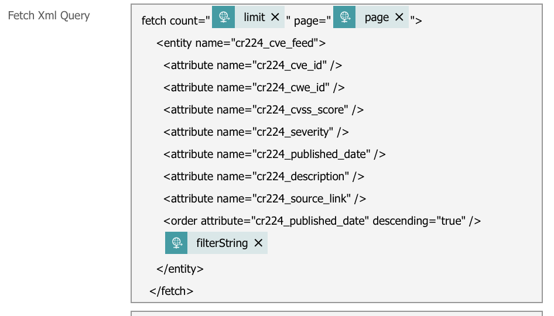

ใน Power Automate ให้เพิ่ม `fetchXml` ใน Request Body JSON Schema:

```json
"fetchXml": {
  "type": "string"
}
```

แล้วทำ `Compose` รับ `fetchXml` จาก trigger ก่อน จากนั้นช่อง `Fetch Xml Query` ใน `List rows` ให้ใส่ `Outputs` จาก Compose ตัวเดียวพอ ไม่ต้องเขียน XML ค้างไว้ใน flow แล้ว

ถ้างงว่าก้อน `Compose` คืออะไร ก้อนนี้คือเหมือนถาดพักของที่เราส่งมาจาก Go ก่อนเอาไปให้ `List rows` กินต่อ แบบกวนๆคือ Go ทำข้าวกล่อง FetchXML มาให้เรียบร้อยแล้ว `Compose` แค่รับกล่องไว้ ส่วน `List rows` ก็หยิบกล่องนั้นไปแดก ไม่ต้องมายืนหั่นผักเขียน XML เองกลาง flow อีก

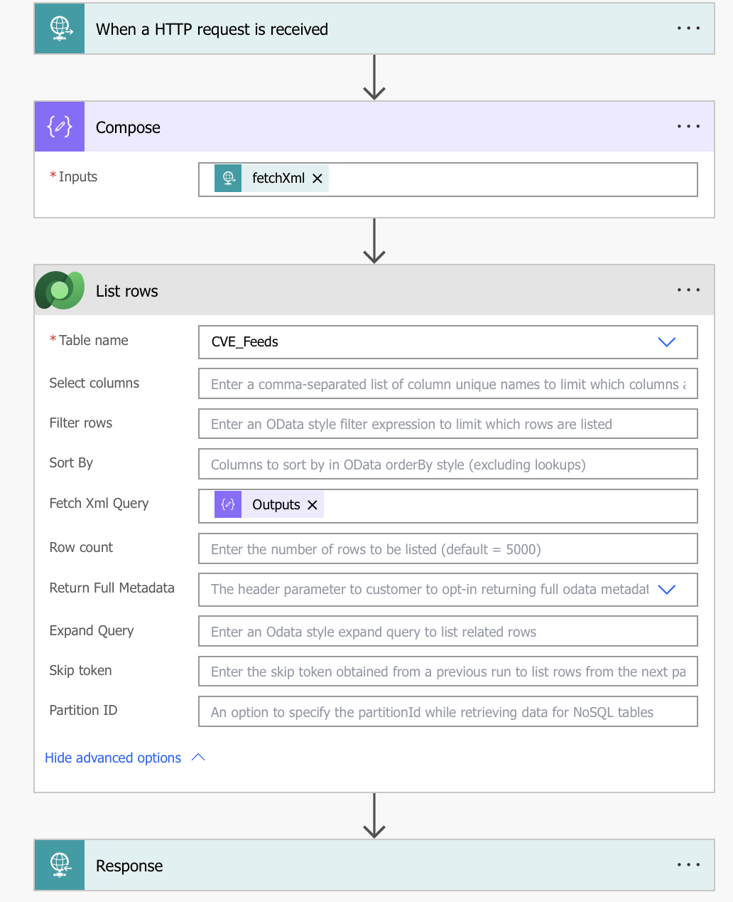

ถ้าไม่ได้ search อะไร Go จะสร้าง filter ประมาณนี้ใน FetchXML:

```xml
<filter type="and"><condition attribute="cr224_cve_id" operator="not-null" /></filter>
```

ถ้ามี search หรือกด filter severity มันก็จะเพิ่ม condition เข้าไปใน fragment นี้ แล้ว Power Automate เอาไปเสียบใน FetchXML ได้เลย

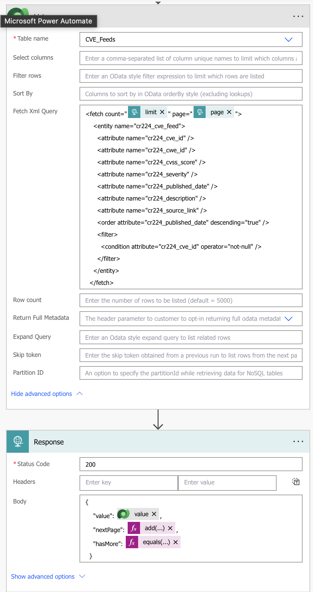

ตัว table ใน Dataverse ที่เก็บข้อมูล CVE

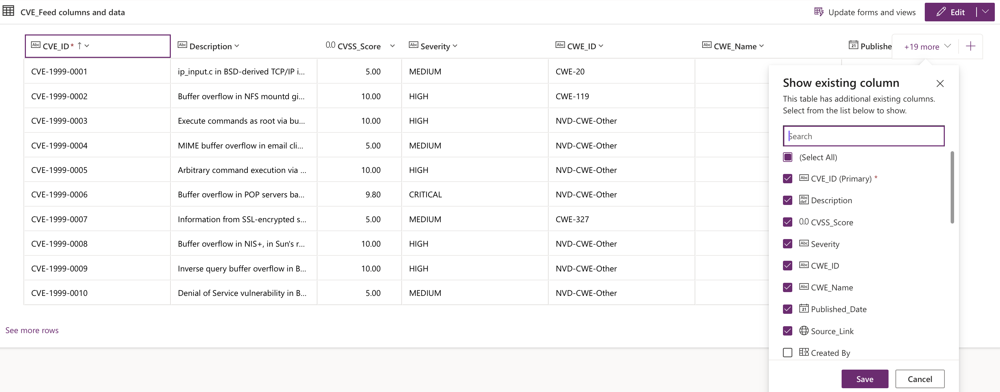

### Response ที่ flow ส่งกลับ

หลังเปลี่ยนมาใช้ page แล้ว Response จะส่งกลับประมาณนี้:

```json
{
  "value": [],
  "nextPage": 2,
  "hasMore": true
}
```

แต่ละตัวคือ:

* `value` คือข้อมูล CVE ที่ได้จาก Dataverse ในหน้านั้น
* `nextPage` คือเลขหน้าถัดไปที่ frontend จะใช้ตอนกด Load More
* `hasMore` คือบอก frontend ว่ายังมีข้อมูลให้โหลดต่อไหม ถ้า `true` ก็โชว์ปุ่ม Load More ต่อ

### Go Proxy ที่แก้เพิ่ม

Go proxy ตอนนี้จะรับ query จาก frontend ประมาณนี้:

```text
/api/cves?limit=50&page=1
```

แล้วส่ง body เข้า Power Automate ประมาณนี้:

```json
{
  "filterString": "cr224_cve_id ne null",
  "limit": 50,
  "page": 1
}
```

จากนั้น Go จะ map field ของ Dataverse ให้เป็น field ที่ frontend ใช้ง่ายกว่า เช่น:

* `cr224_cve_id` -> `cve_id`
* `cr224_cwe_id` -> `cwe_id`
* `cr224_cvss_score` -> `cvss_score`
* `cr224_published_date` -> `published_date`
* `cr224_source_link` -> `source_link`

### Frontend ที่แก้เพิ่ม

frontend ตอนนี้ไม่ได้โหลดข้อมูลทั้งหมดในครั้งเดียวแล้ว แต่โหลดทีละหน้า:

1. เปิดเว็บมาโหลด page 1 ก่อน
2. ถ้า flow ส่ง `hasMore: true` กลับมา ก็โชว์ปุ่ม `Load More`
3. พอกด Load More ก็ยิง page ถัดไปตาม `nextPage`
4. ข้อมูลใหม่ append ต่อจากของเดิมในหน้าเว็บ

### Test result ตอนแก้ Pagination

ลองยิงผ่าน Go proxy แล้วได้ผลประมาณนี้:

```text
/api/cves?limit=5&page=1 -> nextPage: 2, hasMore: true
/api/cves?limit=5&page=2 -> nextPage: 3, hasMore: true
```

page 2 ได้ข้อมูลชุดถัดไปจริง ไม่ใช่ข้อมูลซ้ำจาก page 1 แปลว่า pagination ใช้ได้แล้ว

### Note เรื่อง Search / Filter

Go proxy มีรับ query พวกนี้ไว้แล้ว:

```text
/api/cves?limit=50&page=1&q=CVE-2026-8219
/api/cves?limit=50&page=1&severity=CRITICAL
```

ตอนนี้ Go สร้าง `fetchXml` ทั้งก้อนให้แล้ว เพราะงั้นใน Power Automate ต้องเพิ่ม field `fetchXml` ใน trigger schema แล้วเอา dynamic content `fetchXml` ไปใส่ในช่อง Fetch Xml Query ของ `List rows` ถ้า flow ยังใช้ XML hardcode อยู่ search/filter จะยังไม่ทำงานจริง

หลังแก้เป็น `fetchXml -> Compose -> List rows` แล้วเทสผ่าน:

```text
/api/cves?limit=5&page=1 -> 200 OK
/api/cves?limit=5&page=1&q=CVE-2026-8219 -> 200 OK, ได้รายการเดียว
/api/cves?limit=5&page=1&severity=CRITICAL -> 200 OK, ได้เฉพาะ CRITICAL
```

### How to run

```bash
go run main.go
```

or

```bash
go build -o server main.go
./server
```

เซิฟเวอร์จะเปิดตาม URL ที่เด้งขึ้นมา ปกติคือ:

```text
http://localhost:8080
```

ถ้า port 8080 ชน ใช้ `PORT` เปลี่ยน port ได้:

```bash
PORT=18080 go run main.go
```
